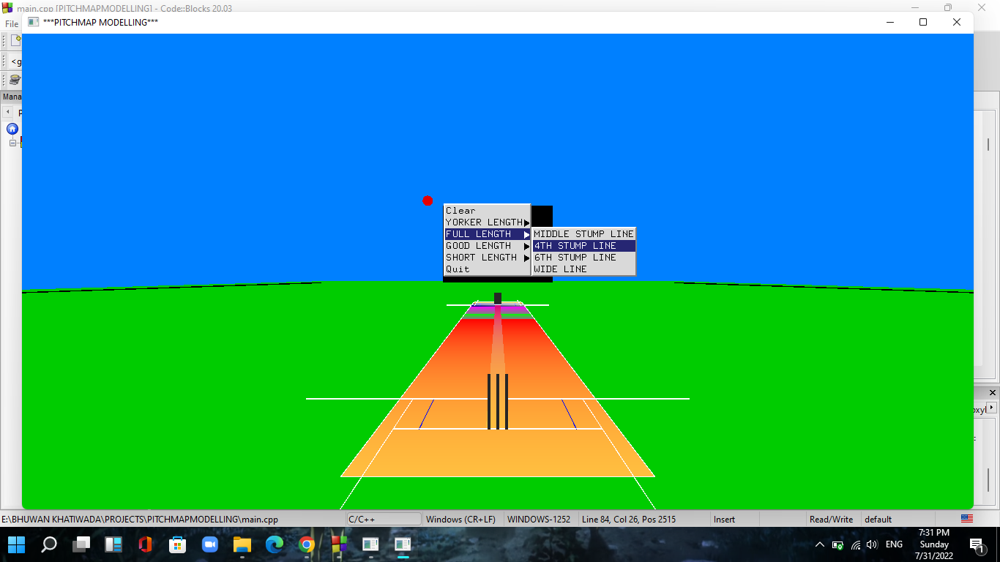

# 3D-Cricket-Pitchmap-Modelling
3D-Cricket Pitchmap Modelling is a OpenGL computer graphics project written in C-language using Glut library. This project displays a standard cricket pitch along with both set of stumps in their original dimensional ratio. The menu button is displayed on the click of right mouse button. The user gets to choose the length of the delivery first and then the line of the ball. As per the selected choices the animation of the delivery path is shown. The viewer can switch in between three viewing angles. Click of "B", "F" and "S" buttons changes the viewing angle to Behind the wicket, Front-on and Side-on angles respectively To run this project file you require preinstallation of the Glut Library. 

<h1>OUTPUT</h1>
- Display of the pitchmap

.
- Menubar

.
- Front-on view

.
- Side-on view

.
- Behind the wicket view

.
- Changing of the delivery type from side on angle

.
- Behind the wicket view of the changed delivery

.

